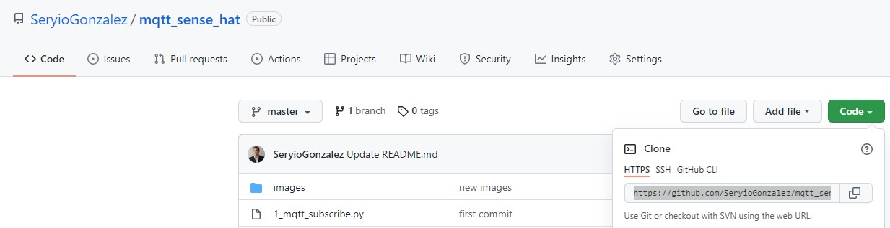
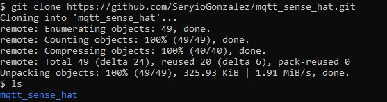
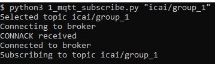
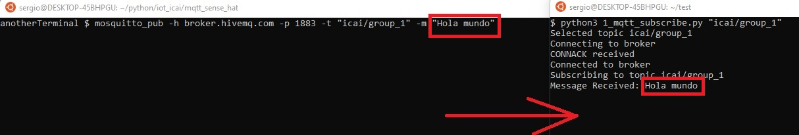

# MQTT and SenseHat lab

The purpose of this lab is showing the functionality of an MQTT broker with an IoT device. <br/>
For the, we will use the free MQTT broker from HiveMQ and a Raspberry Pi with the SenseHat board<br/>
First, we will run a script to subscribe to a topic the broker. With other terminal, we will publish something to the previously subscribed topic and this message shall be displayed out of the command line <br/>
Then, we will run another script to display a message in the terminal.<br/>
Finally, we will integrate both scripts, so the message published to the topic is shown in the Sense Hat display. The logic is shown in the following image:<br/>


## Clone the repo
The first thing you need to do is opening a terminal in your Raspberry Pi, as shown in the following image:<br/>


From there, clone the repo. You can obtain the URL of the repo as shown in the following image:<br/>


In your terminal, launch the following command
```
$ git clone CHANGE_BY_THE_URL_OF_THE_REPO
```
Once the repo has been cloned, a folder with the name of the repo can be seen in the local file system:<br/>



## Topic subscribe and publish
Change to the downloaded directory and execute the following command, putting your assigned group ID:<br/>


Then open another terminal and publish a message to the topic using the mosquitto_pub client:

```
$ mosquitto_pub -h broker.hivemq.com -p 1883 -t "icai/group_1" -m "Hola mundo"
```

Upon success, the subscribed snippet should see a message as shown below:<br/>


## Display a message in your Sense Hat
For this, use the following script on your Sense Hat device:
```
sudo python3 2_sensehat_message_display.py "hola"
```
Note the need to use sudo, i.e. elevated permissions for accesing the display

## Subscribe to an MQTT topic and display the received message on your sense hat
Now the goal is to modify script 3 with lines contained in script 2, so we increment the functionality of the first script to showing received messages on the display
