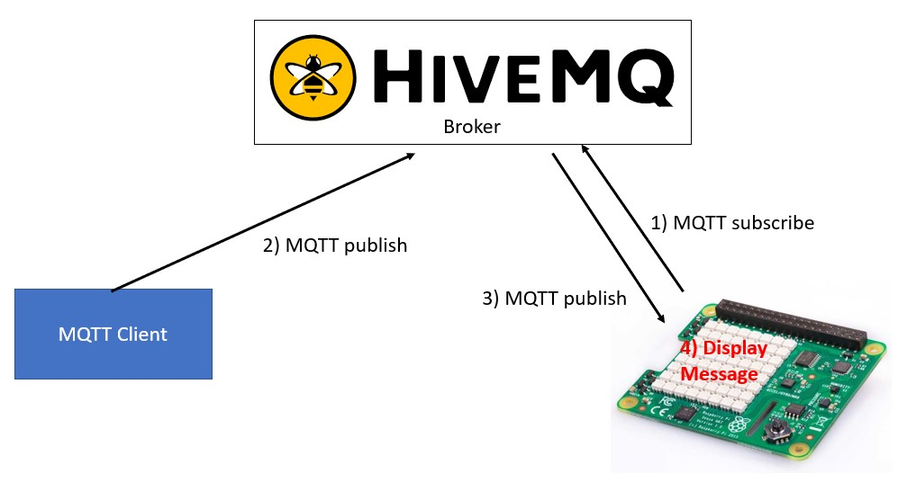

# MQTT and SenseHat lab

The purpose of this lab is showing the functionality of an MQTT broker with an IoT device.  
For the, we will use the free MQTT broker from HiveMQ and a Raspberry Pi with the SenseHat board 
First, we will run a script to subscribe to a topic the broker. With other terminal, we will publish something to the previously subscribed topic and this message shall be displayed out of the command line  
Then, we will run another script to display a message in the terminal. 
Finally, we will integrate both scripts, so the message published to the topic is shown in the sense hat display. The logic is shown in the following image: 

## Clone the repo
The first thing you need to do is opening a terminal in your Raspberry Pi, as shown in the following image: 

